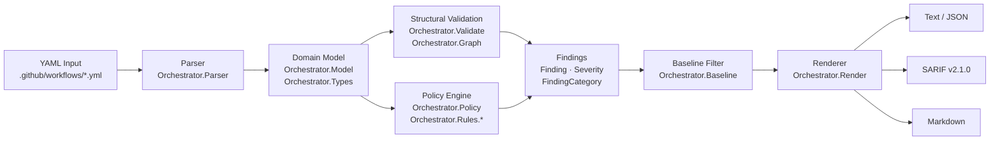
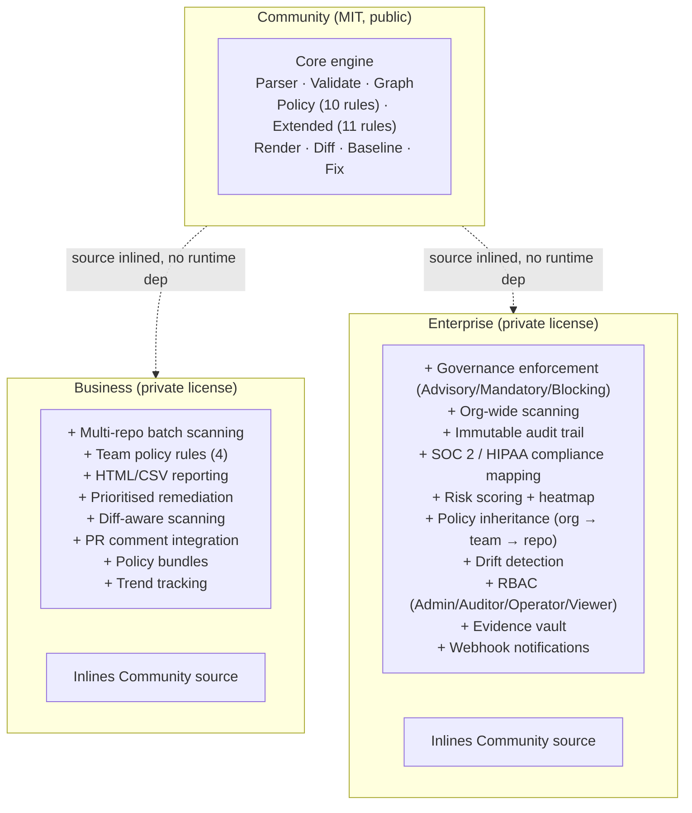
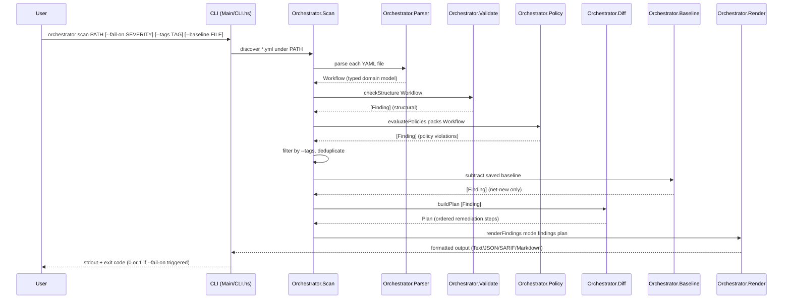
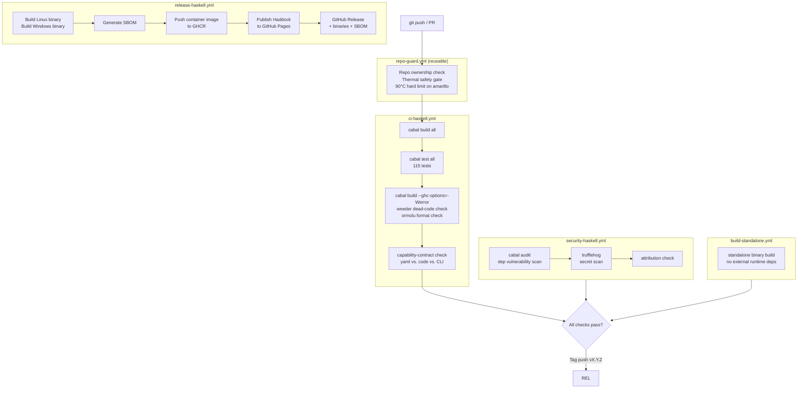

# Haskell Orchestrator — Architecture

Version 3.0.3 | Community Edition | GHC 9.6.7 / GHC2021

---

## 1. System Overview



The tool is purely read-only. No workflow file is modified unless `fix --write` is explicitly passed.

---

## 2. Module Dependency Graph

```mermaid
graph TD
    subgraph Core
        TY[Types]
        MO[Model]
        PA[Parser]
        CF[Config]
    end

    subgraph Analysis
        VA[Validate]
        GR[Graph]
        CX[Complexity]
        BL[Baseline]
        SC[Scan]
    end

    subgraph Policy
        PO[Policy]
        PE[Policy.Extended]
        RS[Rules.Structure]
        RR[Rules.Reuse]
        RM[Rules.Matrix]
        RE[Rules.Environment]
        RC[Rules.Composite]
        RD[Rules.Duplicate]
        RH[Rules.Hardening]
        RSupply[Rules.SupplyChain]
        RDrift[Rules.Drift]
        RPerf[Rules.Performance]
        RCost[Rules.Cost]
    end

    subgraph Output
        RN[Render]
        RMD[Render.Markdown]
        RSA[Render.Sarif]
        RU[Render.Upgrade]
        FO[Formatter]
    end

    subgraph Auxiliary
        DI[Diff]
        FX[Fix]
        TA[Tags]
        SU[Suppress]
        SE[Secrets]
        HK[Hook]
        SI[Simulate]
        GH[GitHub]
        UI[UI]
        LS[LSP]
    end

    subgraph CLI
        MA[Main]
        CL[CLI]
    end

    PA --> MO
    PA --> TY
    MO --> TY
    CF --> TY

    VA --> MO
    VA --> TY
    GR --> MO
    CX --> MO
    BL --> TY
    SC --> PA
    SC --> VA
    SC --> PO
    SC --> BL

    PO --> MO
    PO --> TY
    PO --> CF
    PE --> PO
    PE --> MO
    RS --> MO
    RS --> TY
    RR --> MO
    RM --> MO
    RE --> MO
    RC --> MO
    RD --> MO
    RH --> MO
    RSupply --> MO
    RDrift --> MO
    RPerf --> MO
    RCost --> MO

    RN --> TY
    RMD --> TY
    RSA --> TY
    FO --> TY

    DI --> TY
    DI --> PO
    FX --> MO
    FX --> TY
    TA --> TY
    SU --> TY

    MA --> CL
    MA --> SC
    MA --> PO
    MA --> PE
    MA --> RN
    MA --> DI
    MA --> BL
    MA --> GH
    MA --> UI
    CL --> TY
```



---

## 3. Edition Architecture

Each edition is a standalone binary. No runtime or build dependencies cross edition boundaries. Business and Enterprise inline their own copies of all required source.



Tier boundary enforcement is enforced at build time by `scripts/check-tier-boundaries.sh`, which blocks any import of Business or Enterprise modules from Community source.

---

## 4. Data Flow



---

## 5. Rule Evaluation Pipeline

Policy rules are pure functions — no IO, no state, fully deterministic.

```
PolicyPack
  packName  :: Text
  packRules :: [PolicyRule]
      │
      ▼
PolicyRule
  ruleId       :: Text          -- e.g. "PERM-001"
  ruleName     :: Text
  ruleSeverity :: Severity      -- Info | Warning | Error | Critical
  ruleCategory :: FindingCategory
  ruleTags     :: [RuleTag]     -- security | performance | cost | style | structure
  ruleCheck    :: Workflow -> [Finding]
      │
      │  applied to each parsed Workflow
      ▼
[Finding]
  findingSeverity    :: Severity
  findingRuleId      :: Text
  findingMessage     :: Text
  findingRemediation :: Text
  findingWorkflow    :: Text     -- source file
  findingJob         :: Maybe Text
      │
      ├─ filtered by --tags (RuleTag intersection)
      ├─ filtered by --fail-on (Severity threshold for exit code)
      ├─ subtracted against baseline (Orchestrator.Baseline)
      └─ rendered (Orchestrator.Render / Render.Sarif / Render.Markdown)
```

Built-in packs:

| Pack | Source | Rules |
|---|---|---|
| Standard | `Orchestrator.Policy` | 10 (PERM-001/002, SEC-001/002, RUN-001, CONC-001, RES-001, NAME-001/002, TRIG-001) |
| Extended | `Orchestrator.Policy.Extended` + `Rules.*` | 11 (graph, reuse, matrix, env, composite, duplicate, hardening, supply-chain, drift, performance, cost) |

Total: 36 rules in Community edition (21 core + 15 from extended rule modules).

---

## 6. CI Pipeline Architecture



All workflows run on `[self-hosted, Linux, X64, haskell, unified-all]`. No macOS or Windows build runners.
